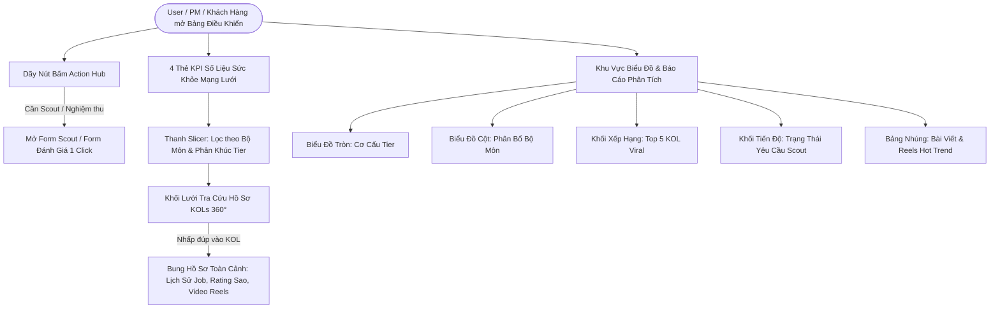

# BẢN THIẾT KẾ LAYOUT & USER FLOW BẢNG ĐIỀU KHIỂN (LARK BASE DASHBOARD)
**Hệ thống Quản lý, Tuyển chọn (Scout) & Đánh giá KOLs / Communities Thể Thao**

---

## 1. USER FLOW (LUỒNG TRẢI NGHIỆM NGƯỜI DÙNG)



---

## 2. SƠ ĐỒ BỐ TRÍ LAYOUT TỔNG THỂ (WIREFRAME MAP)

```
┌───────────────────────────────────────────────────────────────────────────────────────────────────────┐
│ 🚀 KHU VỰC 1: TRUNG TÂM HÀNH ĐỘNG (ACTION HUB) - DÃY NÚT BẤM (BUTTONS)                                  │
│ [ 🚀 Form Scout Tự Động ]   [ ⭐ Form Nghiệm Thu Dự Án ]   [ 👤 Thêm Profile KOL ]   [ 👥 Thêm CLB ]  │
├───────────────────────────────────────────────────────────────────────────────────────────────────────┤
│ 📊 KHU VỰC 2: CHỈ SỐ KPI TỔNG QUAN (METRIC CARDS) - 4 THẺ SỐ LIỆU CHÍNH                               │
│ ┌──────────────────┐  ┌──────────────────┐  ┌──────────────────┐  ┌──────────────────┐                │
│ │  Tổng Số KOLs    │  │  Tổng Lượng Reach│  │  Điểm Uy Tín TB  │  │Chiến Dịch Đang Chạy│               │
│ │      8 KOLs      │  │     5.2M+ Views  │  │   4.9 / 5.0 ⭐   │  │   1 Campaign     │                │
│ └──────────────────┘  └──────────────────┘  └──────────────────┘  └──────────────────┘                │
├───────────────────────────────────────────────────────────────────────────────────────────────────────┤
│ 🔍 KHU VỰC 3: BỘ TRA CỨU HỒ SƠ TOÀN CẢNH 360° (INTERACTIVE SEARCH & DOSSIER)                          │
│ [ Slicer 1: Chọn Bộ Môn (Tất cả / Pickleball / Chạy bộ...) ]   [ Slicer 2: Chọn Phân Khúc (Tier) ]    │
│ ┌───────────────────────────────────────────────────────────────────────────────────────────────────┐ │
│ │ Khối Nhúng Lưới / Kanban: Bảng List KOLs                                                          │ │
│ │ (Avatar | Họ Tên | Bộ Môn | Tier | Followers | ⭐ Lịch Sử Đánh Giá & Dự Án | 🎬 Video Viral)        │ │
│ └───────────────────────────────────────────────────────────────────────────────────────────────────┘ │
├───────────────────────────────────────────────────────────────────────────────────────────────────────┤
│ 📈 KHU VỰC 4: BÁO CÁO PHÂN TÍCH THỊ TRƯỜNG & HIỆU SUẤT (CHARTS & RANKINGS)                            │
│ ┌──────────────────────────────┐  ┌──────────────────────────────┐  ┌──────────────────────────────┐  │
│ │ Biểu Đồ Tròn: Cơ Cấu Tier    │  │ Biểu Đồ Cột: Phân Bổ Bộ Môn  │  │ Khối Xếp Hạng: Top 5 KOL     │  │
│ │ (Mega / Macro / Micro / Nano)│  │ (Pickleball, Running, Gym...)│  │ (Theo Followers & ER %)      │  │
│ └──────────────────────────────┘  └──────────────────────────────┘  └──────────────────────────────┘  │
├───────────────────────────────────────────────────────────────────────────────────────────────────────┤
│ 🔥 KHU VỰC 5: TIẾN ĐỘ VẬN HÀNH & KHO NỘI DUNG VIRAL (OPERATION & VIRAL FEED)                          │
│ ┌───────────────────────────────────────────────┐  ┌────────────────────────────────────────────────┐ │
│ │ Khối Tiến Độ (Progress / Gauge):              │  │ Khối Nhúng Lưới: Kho Bài Viết / Reels Hot Trend│ │
│ │ Tình trạng Yêu Cầu Scout (Chờ xử lý / Xong)   │  │ (Thumbnail | Tác giả | Views | Link Post)      │ │
│ └───────────────────────────────────────────────┘  └────────────────────────────────────────────────┘ │
└───────────────────────────────────────────────────────────────────────────────────────────────────────┘
```

---

## 3. HƯỚNG DẪN CẤU HÌNH CHI TIẾT TỪNG KHỐI (STEP-BY-STEP)

Quý khách bấm nút **`+ Thêm khối`** ở thanh trên cùng của màn hình và thiết lập theo từng khối dưới đây:

### KHU VỰC 1: CÁC NÚT BẤM THAO TÁC NHANH (ACTION BUTTONS)
* **Khối 1.1: Nút Form Scout Tự Động**
  * *Chọn loại khối:* **Nút** (Button).
  * *Tên nút:* `🚀 Gửi Yêu Cầu Scout (FB / IG / Threads)`.
  * *Hành động (Action):* Mở liên kết (Open URL).
  * *Đường dẫn:* `https://ujpumxyv47ap.jp.larksuite.com/base/Ow1ab1cKxaOHTBs32zvjsg32phe?table=tbl7JHIEfZNQRaD3&view=vew9DSEeqi`
  * *Màu sắc:* Xanh dương (Primary Blue).
* **Khối 1.2: Nút Form Đánh Giá Nghiệm Thu**
  * *Chọn loại khối:* **Nút** (Button).
  * *Tên nút:* `⭐ Đánh Giá & Nghiệm Thu Dự Án`.
  * *Hành động:* Mở liên kết.
  * *Đường dẫn:* `https://ujpumxyv47ap.jp.larksuite.com/base/Ow1ab1cKxaOHTBs32zvjsg32phe?table=tblz9lj9JCxMwJE3&view=vew5lEGugY`
  * *Màu sắc:* Cam / Vàng (Warning/Accent).
* **Khối 1.3: Nút Form Thêm KOL Mới**
  * *Chọn loại khối:* **Nút** (Button).
  * *Tên nút:* `👤 Thêm Hồ Sơ KOL Mới`.
  * *Hành động:* Mở liên kết.
  * *Đường dẫn:* `https://ujpumxyv47ap.jp.larksuite.com/base/Ow1ab1cKxaOHTBs32zvjsg32phe?table=tbllpqJ68WvvqHL4&view=vewKYvj9vc`
* **Khối 1.4: Nút Form Thêm Hội Nhóm CLB**
  * *Chọn loại khối:* **Nút** (Button).
  * *Tên nút:* `👥 Thêm Nhóm / CLB Thể Thao`.
  * *Hành động:* Mở liên kết.
  * *Đường dẫn:* `https://ujpumxyv47ap.jp.larksuite.com/base/Ow1ab1cKxaOHTBs32zvjsg32phe?table=tblMYU5kXPhKV6X5&view=vew0GaYFb5`

---

### KHU VỰC 2: CÁC THẺ CHỈ SỐ KPI TỔNG QUAN (METRIC CARDS)
* **Khối 2.1: Tổng Số KOLs**
  * *Chọn loại khối:* **Số liệu** (Metric Card).
  * *Bảng dữ liệu:* `List KOLs`.
  * *Chỉ số thống kê:* Đếm số dòng (`COUNT of Tên KOL / Kênh`).
  * *Tiêu đề hiển thị:* `Tổng KOLs Trong Mạng Lưới`.
* **Khối 2.2: Tổng Reach Ước Tính**
  * *Chọn loại khối:* **Số liệu** (Metric Card).
  * *Bảng dữ liệu:* `List KOLs`.
  * *Chỉ số thống kê:* Tính tổng (`SUM of Số lượng Followers`).
  * *Tiêu đề hiển thị:* `Tổng Lượng Theo Dõi (Reach)`.
* **Khối 2.3: Điểm Đánh Giá Uy Tín Trung Bình**
  * *Chọn loại khối:* **Số liệu** (Metric Card).
  * *Bảng dữ liệu:* `Report Form`.
  * *Chỉ số thống kê:* Tính trung bình (`AVERAGE of Đánh giá chung 1-5 sao`).
  * *Tiêu đề hiển thị:* `Điểm Uy Tín Hợp Tác TB`.
* **Khối 2.4: Chiến Dịch Đang Chạy**
  * *Chọn loại khối:* **Số liệu** (Metric Card).
  * *Bảng dữ liệu:* `List Project`.
  * *Chỉ số thống kê:* Đếm số dòng (`COUNT`).
  * *Tiêu đề hiển thị:* `Chiến Dịch Đang Triển Khai`.

---

### KHU VỰC 3: BỘ TRA CỨU HỒ SƠ TOÀN CẢNH 360° (SLICER & LƯỚI)
* **Khối 3.1: Bộ lọc Bộ Môn (Slicer)**
  * *Chọn loại khối:* **Slicer** (Bộ lọc dữ liệu).
  * *Bảng dữ liệu liên kết:* `List KOLs`.
  * *Trường lọc:* Cột `Bộ môn thể thao`.
  * *Tác dụng:* Khi người dùng nhấp vào "Pickleball" hoặc "Chạy bộ", toàn bộ danh sách KOL phía dưới sẽ được lọc tức thì.
* **Khối 3.2: Bộ lọc Phân Khúc (Slicer)**
  * *Chọn loại khối:* **Slicer**.
  * *Bảng dữ liệu liên kết:* `List KOLs`.
  * *Trường lọc:* Cột `Phân khúc (KOL Tier)`.
* **Khối 3.3: Bảng Tra Cứu Hồ Sơ KOL 360°**
  * *Chọn loại khối:* **Lưới** (Grid View Embed).
  * *Bảng dữ liệu:* `List KOLs`.
  * *Chọn View hiển thị:* `Mặc định` hoặc `Thẻ Danh Thiếp`.
  * *Cột hiển thị ưu tiên:* `Tên KOL`, `Bộ môn`, `Tier`, `Followers`, `Khu vực`, `⭐ Lịch Sử Đánh Giá & Dự Án`, `🎬 Bài Viết & Reels Đã Scout`.
  * *Trải nghiệm người dùng:* Người dùng chỉ cần nhấp đúp vào dòng KOL bất kỳ, popup toàn màn hình sẽ bung ra mọi thông tin chiến dịch đã từng làm việc và bài viết viral!

---

### KHU VỰC 4: BÁO CÁO PHÂN TÍCH THỊ TRƯỜNG & HIỆU SUẤT
* **Khối 4.1: Tỷ lệ phân bổ theo Tier**
  * *Chọn loại khối:* **Biểu đồ tròn** (Pie Chart).
  * *Bảng dữ liệu:* `List KOLs`.
  * *Phân nhóm (Dimension):* Cột `Phân khúc (KOL Tier)`.
  * *Chỉ số (Metric):* `COUNT`.
* **Khối 4.2: Phân bổ số lượng theo Bộ môn thể thao**
  * *Chọn loại khối:* **Cột** (Bar Chart).
  * *Bảng dữ liệu:* `List KOLs`.
  * *Trục X (Category):* Cột `Bộ môn thể thao`.
  * *Trục Y (Value):* `COUNT of Tên KOL`.
* **Khối 4.3: Top 5 KOLs có lượt tương tác hoặc follower cao nhất**
  * *Chọn loại khối:* **Xếp hạng** (Ranking).
  * *Bảng dữ liệu:* `List KOLs`.
  * *Tên hiển thị:* Cột `Tên KOL / Kênh`.
  * *Giá trị xếp hạng:* Cột `Số lượng Followers` (hoặc `Tỷ lệ tương tác ER %`).
  * *Hiển thị:* Top 5.

---

### KHU VỰC 5: TIẾN ĐỘ VẬN HÀNH & KHO NỘI DUNG VIRAL
* **Khối 5.1: Tình trạng xử lý yêu cầu Scout**
  * *Chọn loại khối:* **Tiến độ** (Progress) hoặc **Biểu đồ tròn**.
  * *Bảng dữ liệu:* `Scout request`.
  * *Phân nhóm:* Cột `Trạng thái xử lý` (*Chờ xử lý, Đang cào dữ liệu, Đã hoàn thành*).
* **Khối 5.2: Kho Bài Viết & Video Reels Hot Trend**
  * *Chọn loại khối:* **Lưới** (Grid View Embed).
  * *Bảng dữ liệu:* `Post Scout`.
  * *Cột hiển thị:* `Tiêu đề / Trích đoạn`, `Tác giả`, `Nền tảng`, `Lượt Xem Video (Views)`, `Đánh giá độ Viral`, `Link bài viết`.
