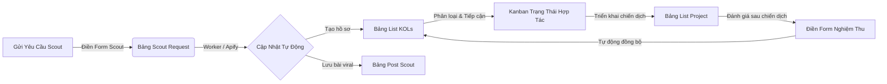

# HƯỚNG DẪN THIẾT LẬP VÀ VẬN HÀNH PORTAL & DASHBOARD TRÊN LARK BASE
**Hệ thống Quản lý, Tuyển chọn (Scout) & Đánh giá KOLs / Communities Thể Thao**

---

## 1. TỔNG QUAN HỆ THỐNG ĐÃ TRIỂN KHAI

Hệ thống đã được thiết lập và cấu hình hoàn chỉnh trực tiếp trên Lark Base theo kiến trúc **Zero-Infra Portal** (Không cần server trung gian, vận hành 100% trên giao diện Lark trực quan và bảo mật).

* **Đường dẫn truy cập Lark Base:** [KOL & Community Sport Booking Base](https://ujpumxyv47ap.jp.larksuite.com/base/Ow1ab1cKxaOHTBs32zvjsg32phe)
* **Quyền quản trị cao nhất:** Tài khoản `leminhhoangtk2000@gmail.com` đã được bàn giao quyền **Chủ sở hữu (Owner / Full Access)**.

---

## 2. TRUNG TÂM HÀNH ĐỘNG (ACTION PORTAL) - KHÔNG CẦN CHẠM RAW DATA

Để giải quyết bài toán người dùng không muốn thao tác trực tiếp trên các bảng tính Excel / bảng dữ liệu thô, 4 biểu mẫu tương tác (Forms) đã được kích hoạt. Người dùng chỉ cần nhấp link hoặc quét mã QR:

| Tác vụ hành động | Mục đích sử dụng | Đường dẫn Form trực tiếp |
| :--- | :--- | :--- |
| **🚀 Yêu Cầu Scout Tự Động** | Nhập link FB/IG/Threads hoặc từ khóa, hệ thống tự động cào dữ liệu và phân loại | [Nhấp vào đây để mở Form Scout](https://ujpumxyv47ap.jp.larksuite.com/base/Ow1ab1cKxaOHTBs32zvjsg32phe?table=tbl7JHIEfZNQRaD3&view=vew9DSEeqi) |
| **⭐ Đánh Giá & Nghiệm Thu** | Chấm điểm uy tín, rate card, hiệu quả sau mỗi chiến dịch/job booking | [Nhấp vào đây để mở Form Đánh Giá](https://ujpumxyv47ap.jp.larksuite.com/base/Ow1ab1cKxaOHTBs32zvjsg32phe?table=tblz9lj9JCxMwJE3&view=vew5lEGugY) |
| **👤 Thêm Mới Hồ Sơ KOL** | Nhập nhanh profile KOL mới thủ công (kèm hợp đồng, báo giá, liên hệ) | [Nhấp vào đây để mở Form Thêm KOL](https://ujpumxyv47ap.jp.larksuite.com/base/Ow1ab1cKxaOHTBs32zvjsg32phe?table=tbllpqJ68WvvqHL4&view=vewKYvj9vc) |
| **👥 Thêm Mới Hội Nhóm / CLB** | Nhập thông tin Group Facebook, CLB Pickleball/Chạy bộ, Admin liên hệ | [Nhấp vào đây để mở Form Thêm Community](https://ujpumxyv47ap.jp.larksuite.com/base/Ow1ab1cKxaOHTBs32zvjsg32phe?table=tblMYU5kXPhKV6X5&view=vew0GaYFb5) |

---

## 3. HỆ THỐNG 15 MULTI-VIEWS CHUYÊN BIỆT

Toàn bộ dữ liệu được tự động phân tách và trình bày dưới nhiều góc nhìn (Views) thông minh:

### Bảng 1: List KOLs (Quản lý Hồ sơ Nhân sự & Vận động viên)
1. **🖼️ Gallery - Thẻ Danh Thiếp KOLs:** Hiển thị thẻ avatar lớn, tóm tắt Bộ môn, Tier, Followers, và Điểm đánh giá uy tín.
2. **📊 Kanban - Theo Phân Khúc (Tier):** Cột kéo thả phân loại Celebrity, Mega, Macro, Micro, Nano KOLs.
3. **🏅 Kanban - Theo Bộ Môn Thể Thao:** Cột phân theo Chạy bộ, Bóng đá, Gym & Fitness, Pickleball, Cầu lông, v.v.
4. **🤝 Kanban - Trạng Thái Hợp Tác:** Theo dõi vòng đời: Đang tiếp cận -> Đang đàm phán -> Đang chạy Job -> Ký dài hạn.
5. **📍 Grid - Khu Vực Hà Nội:** Bộ lọc tự động các KOLs sinh sống và hoạt động tại miền Bắc / Hà Nội.
6. **📍 Grid - Khu Vực TP.HCM:** Bộ lọc tự động các KOLs tại miền Nam / TP.HCM.
7. **📱 Grid - Kênh Instagram:** Tổng hợp KOLs mạnh về hình ảnh, Reels, thời trang thể thao trên Instagram.
8. **📘 Grid - Kênh Facebook & Threads:** Tổng hợp KOLs tương tác cộng đồng, thảo luận trên Facebook & Threads.

### Bảng 2: List Community (Quản lý Hội nhóm & CLB)
9. **🖼️ Gallery - Danh Thiếp Nhóm & CLB:** Xem thẻ trực quan của các CLB Runners, Hội Vợt Thủ, Cộng đồng thể thao.
10. **🏅 Kanban - Theo Bộ Môn:** Nhóm theo Chạy bộ, Pickleball, Tennis, Đạp xe.
11. **🌐 Grid - Nền Tảng:** Phân loại Group Facebook, CLB Strava, Nhóm Zalo VIP.

### Bảng 6: Post Scout (Kho Nội dung & Xu hướng Viral)
12. **🔥 Kanban - Theo Độ Viral:** Phân loại bài viết theo mức độ lan tỏa: Siêu Hot (>100k views), Xu Hướng Tốt, Tiêu Chuẩn.
13. **🖼️ Gallery - Video Reels & Bài Viết:** Hiển thị thumbnail video/ảnh của các bài viết thể thao hot trend để tham khảo ý tưởng booking.

### Bảng 3: List Project (Quản lý Chiến dịch Booking)
14. **📌 Kanban - Tiến Độ Chiến Dịch:** Theo dõi các campaign: Planning -> Booking -> Đang triển khai -> Nghiệm thu -> Hoàn thành.
15. **📅 Gantt - Dòng Thời Gian Chiến Dịch:** Lịch biểu Gantt trực quan thời gian chạy bài, ngày nghiệm thu theo tháng/quý.

---

## 4. HỒ SƠ TOÀN CẢNH 360° CỦA MỖI KOL (LINKED DOSSIER)

Người dùng không cần tìm kiếm rời rạc nhiều bảng. Khi mở bất kỳ một KOL nào (nhấp đúp chuột vào hàng hoặc thẻ Gallery):
* **Cột `⭐ Lịch Sử Đánh Giá & Dự Án` (Liên kết Bảng 4):** Lập tức hiển thị tất cả các lần KOL này từng tham gia chiến dịch với thương hiệu, điểm rating chi tiết, thái độ làm việc, ghi chú của PM.
* **Cột `🎬 Bài Viết & Reels Đã Scout` (Liên kết Bảng 6):** Lập tức hiển thị các link bài viết hot, clip Reels đã được cào về từ mạng xã hội của KOL này.

---

## 5. HƯỚNG DẪN TẠO DASHBOARD TRỰC QUAN (TRANG TỔNG QUAN)

Để có một Dashboard đồ họa hiển thị biểu đồ tròn, biểu đồ cột và các chỉ số KPI:

### Bước 1: Mở Tab Dashboard
1. Tại góc trên bên trái của Lark Base, cạnh danh sách các bảng tính, nhấp vào nút **`+`** (Thêm bảng / Add view).
2. Chọn loại **Dashboard** (Bảng thông tin / Bảng điều khiển).
3. Đặt tên: `📊 Dashboard Điều Hành KOLs & Chiến Dịch`.

### Bước 2: Thêm các Widget đề xuất
1. **Widget 1: Chỉ số tổng quan (Metric Card / Number):**
   * *Nguồn dữ liệu:* Bảng `List KOLs`.
   * *Chỉ số:* Tổng số lượng KOLs trong mạng lưới, Tổng Reach ước tính.
2. **Widget 2: Cơ cấu KOL theo Phân khúc (Pie Chart / Biểu đồ tròn):**
   * *Nguồn dữ liệu:* Bảng `List KOLs`.
   * *Nhóm theo (Group by):* Cột `Tier`.
   * *Hiển thị:* % Tỷ lệ Micro, Macro, Nano, Mega.
3. **Widget 3: Phân bổ KOL theo Bộ môn Thể thao (Bar Chart / Biểu đồ cột ngang):**
   * *Nguồn dữ liệu:* Bảng `List KOLs`.
   * *Trục X / Nhóm:* Cột `Bộ môn`.
   * *Trục Y:* Số lượng hồ sơ. Giúp nhận biết môn thể thao nào đang mạnh hoặc thiếu hụt để đẩy mạnh scout.
4. **Widget 4: Tình trạng Xử lý Yêu cầu Scout (Donut Chart):**
   * *Nguồn dữ liệu:* Bảng `Scout request`.
   * *Nhóm theo:* Cột `Trạng thái xử lý` (Chờ xử lý, Đang cào dữ liệu, Đã hoàn thành).
5. **Widget 5: Ngân sách & Điểm Đánh Giá Dự Án (Bar / Gauge Chart):**
   * *Nguồn dữ liệu:* Bảng `Report Form`.
   * *Chỉ số:* Điểm trung bình Đánh giá hiệu quả, Đánh giá thái độ làm việc.

---

## 6. QUY TRÌNH VẬN HÀNH CHUẨN (SOP CHO TEAM)

1. **Bước 1 (Thu thập & Tìm kiếm):** Nhân sự marketing / khách hàng truy cập `Form Scout`, dán link Instagram/Facebook của vận động viên muốn kiểm tra.
2. **Bước 2 (Cào dữ liệu & Chuẩn hóa):** Bot tự động lấy thông tin, cào số follower, bài viết hot và tạo mới bản ghi vào `List KOLs` hoặc `Post Scout`.
3. **Bước 3 (Lọc & Chọn lựa):** Quản lý mở các View `Kanban Bộ môn`, `Gallery Thẻ`, hoặc `Grid Khu vực` để chọn đúng gương mặt phù hợp với chiến dịch.
4. **Bước 4 (Triển khai & Đánh giá):** Sau khi hoàn thành hợp đồng, nhân sự chỉ cần điền `Form Đánh Giá Nghiệm Thu` (30 giây). Hồ sơ 360° của KOL đó sẽ mãi mãi lưu giữ lịch sử hợp tác này.
